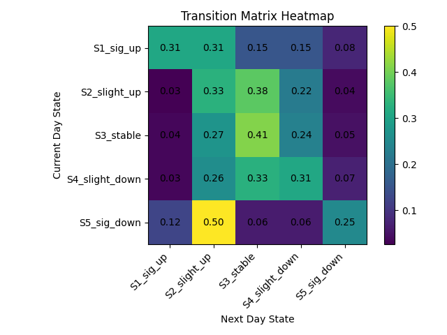
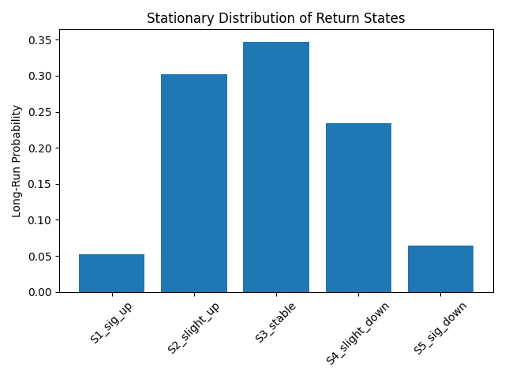

# Markov Chain Stock Price Modeling
A quantitative finance project applying Markov chains to model stock price dynamics using real-world data.

## Key Features
- Implemented a discrete-time Markov chain model for financial time series  
- Constructed transition matrices from real stock data (AAPL)  
- Computed the stationary distribution using power iteration  
- Visualized transition dynamics with heatmaps and statistical plots
- 
## Overview
This project models stock price dynamics using a discrete-time Markov chain. 
Daily returns are classified into 5 states to analyze transition behavior and long-term trends.

## Data
- Source: Yahoo Finance (AAPL)
- Daily adjusted closing prices
- Converted into percentage returns

## State Definition
- S1: Significant Increase (>= +3%)
- S2: Slight Increase (+0.5% to +3%)
- S3: Stable (-0.5% to +0.5%)
- S4: Slight Decrease (-3% to -0.5%)
- S5: Significant Decrease (<= -3%)

## Methodology
- Convert prices → returns → states
- Build transition matrix
- Compute the stationary distribution (power iteration)

## Results

### Transition Matrix


The transition matrix shows high probability mass concentrated near diagonal entries, indicating that daily stock movements tend to remain within nearby states.

### Stationary Distribution


The stationary distribution highlights that the "stable" state dominates in the long run, suggesting that large price fluctuations are relatively rare.

## Key Insights
- Most probability mass is near stable states
- Extreme movements are rare
- Indicates moderate volatility

## Tech Stack
Python, NumPy, pandas, Matplotlib

## How to Run

```bash
pip install -r requirements.txt
python main.py
